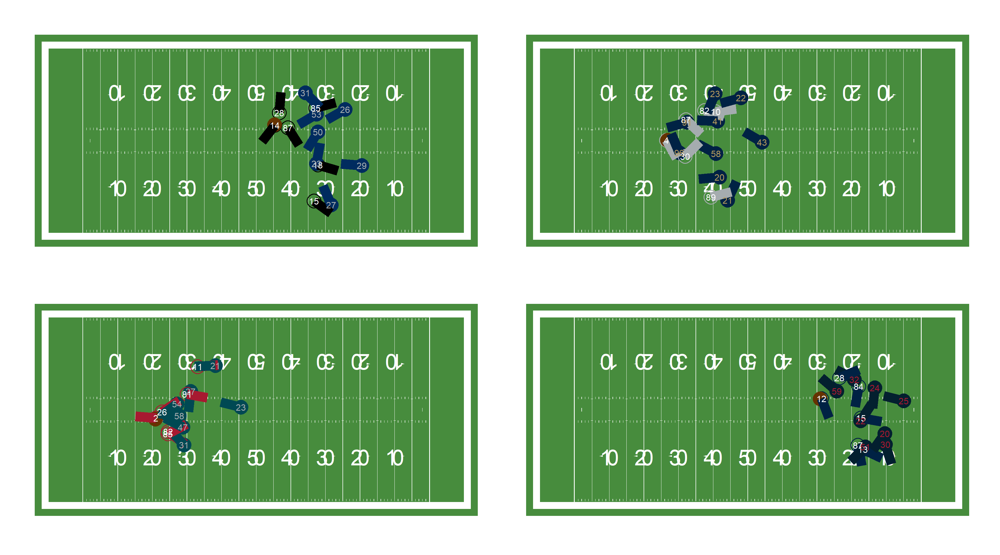
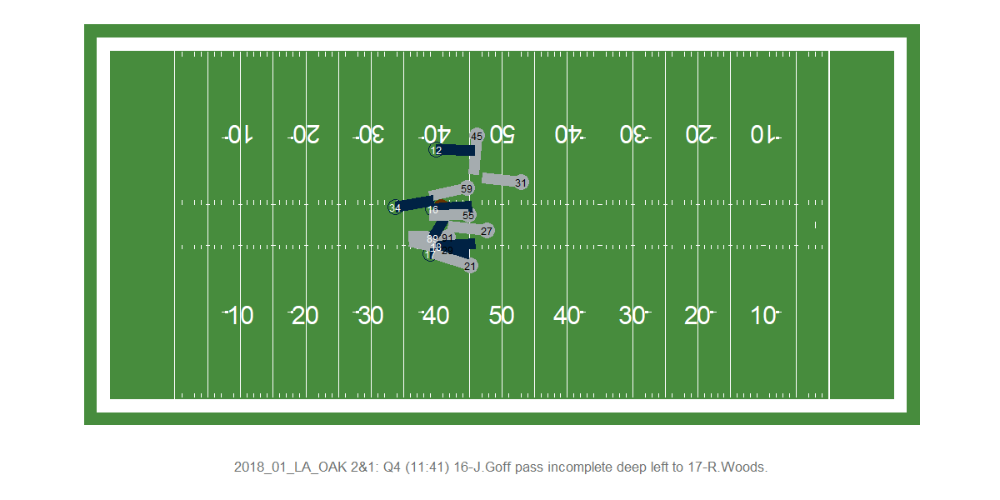

ngscleanR
================

`ngscleanR` is a set of functions to clean up and standardize NFL player
tracking data. The package handles some of the necessary, but boring,
parts of dealing with player tracking data. The included functions:

-   **`clean_and_rotate()`**: Makes all plays go from left to right,
    append some play information from `nflfastR` (yard line, play
    description, play type, etc), and add some post-standardized
    information about where the player is moving and facing (e.g.,
    `s_x`, `s_y`, `o_x`, `o_y`, etc)
-   **`compute_o_diff()`**: Computes difference in orientation between
    direction player is currently facing and \#’ orientation if player
    were facing towards a given x and y location. For example, this
    could be used to determine the extent to which a player is facing
    towards the quarterback on a given frame.
-   **`cut_plays()`** Trim frames for a play and/or remove plays based
    on how quickly provided events happen in the play. For example, this
    could be used to remove frames after a pass was thrown or discard
    plays where a pass is thrown very quickly.
-   **`prepare_bdb_week()`**: A wrapper around the above three functions
    that cleans the raw data from the 2021 Big Data Bowl (2018 season).
-   **`plot_play()`**: A wrapper around `ggplot` and `gganimate` for
    plotting a play.

## Usage

First we load the necessary packages (`patchwork` is for the plot at the
end).

``` r
library(ngscleanR)
library(tidyverse)
library(patchwork)
```

## Load sample week

To demonstrate the package features, we start by loading some small
sample data stored in the package github repo that come from 2021 Big
Data Bowl:

``` r
tracking <- readRDS("data-raw/sample_bdb_2021.rds")
names(tracking)
#>  [1] "time"          "x"             "y"             "s"            
#>  [5] "a"             "dis"           "o"             "dir"          
#>  [9] "event"         "nflId"         "displayName"   "jerseyNumber" 
#> [13] "position"      "frameId"       "team"          "gameId"       
#> [17] "playId"        "playDirection" "route"
```

## The main function

This will clean up the data, attach some information associated with the
play, and make everything face from left to right.

``` r
cleaned <- tracking %>%
  clean_and_rotate()

names(cleaned)
#>  [1] "time"             "x"                "y"                "s"               
#>  [5] "a"                "dis"              "o"                "dir"             
#>  [9] "event"            "nfl_id"           "display_name"     "jersey_number"   
#> [13] "position"         "frame_id"         "team"             "game_id"         
#> [17] "play_id"          "play_direction"   "route"            "team_name"       
#> [21] "defense"          "play"             "nflfastr_game_id" "week"            
#> [25] "posteam"          "home_team"        "away_team"        "down"            
#> [29] "ydstogo"          "yardline_100"     "qtr"              "epa"             
#> [33] "yards_gained"     "air_yards"        "desc"             "pass"            
#> [37] "rush"             "play_type_nfl"    "team_color"       "team_color2"     
#> [41] "team_logo_espn"   "los_x"            "dist_from_los"    "o_x"             
#> [45] "o_y"              "dir_x"            "dir_y"            "s_x"             
#> [49] "s_y"              "a_x"              "a_y"
```

## Play cutting function

This discards any plays where the throw happens before frame 25
(i.e. 1.5 seconds into the play). In addition, it removes any frames
that took place more than 10 frames after a pass was thrown or some
other play ending event (sack, fumble, etc).

``` r
cleaned <- cleaned %>%
  cut_plays(
    # get rid of plays with throw before this frame
    throw_frame = 25,
    # get rid of frames that happen after this many frames after pass released
    time_after_event = 10
  )

names(cleaned)
#>  [1] "time"             "x"                "y"                "s"               
#>  [5] "a"                "dis"              "o"                "dir"             
#>  [9] "event"            "nfl_id"           "display_name"     "jersey_number"   
#> [13] "position"         "frame_id"         "team"             "game_id"         
#> [17] "play_id"          "play_direction"   "route"            "team_name"       
#> [21] "defense"          "play"             "nflfastr_game_id" "week"            
#> [25] "posteam"          "home_team"        "away_team"        "down"            
#> [29] "ydstogo"          "yardline_100"     "qtr"              "epa"             
#> [33] "yards_gained"     "air_yards"        "desc"             "pass"            
#> [37] "rush"             "play_type_nfl"    "team_color"       "team_color2"     
#> [41] "team_logo_espn"   "los_x"            "dist_from_los"    "o_x"             
#> [45] "o_y"              "dir_x"            "dir_y"            "s_x"             
#> [49] "s_y"              "a_x"              "a_y"              "end_frame"       
#> [53] "max_frame"
```

## Plot some sample plays

Here is a demonstration of the `plot_play` function on some still
frames:

``` r
ex <- sample(cleaned$play, 4)

plots <- map(ex, ~ {
  plot <- cleaned %>%
    filter(play == .x) %>%
    plot_play(
      # show still frame, not animation
      animated = FALSE,
      # just plot this frame_id
      frame = 28,
      segment_length = 6,
      segment_size = 3,
      dot_size = 4
    )

  plot +
    theme(
      plot.title = element_blank(),
      plot.caption = element_blank(),
      plot.margin = unit(c(0, 0, 0, 0), "cm")
    )
})

(plots[[1]] + plots[[2]]) / (plots[[3]] + plots[[4]])
```

<!-- -->

Or we can animate a play:

``` r
ex <- sample(cleaned$play, 1)

plot <- cleaned %>%
  filter(play == ex) %>%
  plot_play(
    # show still frame, not animation
    animated = TRUE,
    # just plot this frame_id
    segment_length = 6,
    segment_size = 3,
    dot_size = 4,
    animated_h = 4,
    animated_w = 8,
    animated_res = 150
  )


plot
```

<!-- -->

## The big cleaning function

And the wrapper that can be used to prepare raw 2021 Big Data Bowl data.
See [this Open Source Football
post](https://www.opensourcefootball.com/posts/2021-05-31-computer-vision-in-r-using-torch/)
for how it might be useful.

``` r
prepare_bdb_week(
  week = 1,
  dir = "../nfl-big-data-bowl-2021/input",
  trim_frame = 25,
  frames_after_throw = 10,
  keep_frames = c(30),
  drop_positions = c("QB")
) %>%
  str()
#> 
#> -- Column specification --------------------------------------------------------
#> cols(
#>   time = col_datetime(format = ""),
#>   x = col_double(),
#>   y = col_double(),
#>   s = col_double(),
#>   a = col_double(),
#>   dis = col_double(),
#>   o = col_double(),
#>   dir = col_double(),
#>   event = col_character(),
#>   nflId = col_double(),
#>   displayName = col_character(),
#>   jerseyNumber = col_double(),
#>   position = col_character(),
#>   frameId = col_double(),
#>   team = col_character(),
#>   gameId = col_double(),
#>   playId = col_double(),
#>   playDirection = col_character(),
#>   route = col_character()
#> )
#> tibble [13,057 x 15] (S3: tbl_df/tbl/data.frame)
#>  $ week         : int [1:13057] 1 1 1 1 1 1 1 1 1 1 ...
#>  $ frame_id     : num [1:13057] 30 30 30 30 30 30 30 30 30 30 ...
#>  $ nfl_id       : num [1:13057] 2507763 2540158 2552582 2552600 2553502 ...
#>  $ play         : chr [1:13057] "2018090600_1037" "2018090600_1037" "2018090600_1037" "2018090600_1037" ...
#>  $ defense      : num [1:13057] 0 0 0 0 0 1 1 1 1 1 ...
#>  $ x            : num [1:13057] 56.1 55.7 48.4 57.4 50.8 ...
#>  $ y            : num [1:13057] 14.4 32.3 31.4 37.8 22.5 ...
#>  $ s_x          : num [1:13057] 5.595 4.438 -0.228 5.443 0.514 ...
#>  $ s_y          : num [1:13057] -3.847 -3.978 -0.693 -1.757 -4.611 ...
#>  $ a_x          : num [1:13057] 2.719 1.191 -0.741 2.493 0.505 ...
#>  $ a_y          : num [1:13057] -1.87 -1.068 -2.251 -0.805 -4.532 ...
#>  $ o            : num [1:13057] 120.2 102.1 126 80.9 180.9 ...
#>  $ o_to_qb      : num [1:13057] 0.883 0.864 0.688 0.88 0.75 ...
#>  $ los_x        : num [1:13057] 53 53 53 53 53 53 53 53 53 53 ...
#>  $ dist_from_los: num [1:13057] 3.09 2.67 -4.63 4.4 -2.2 ...
```
